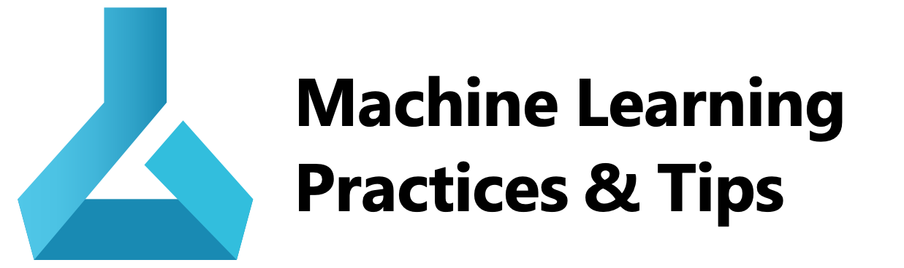

<h4 align="center">機械学習プロジェクトを進めるためのガイドブック</h4>

<h5 align="center">2021/04/01 : $\beta$ Version</h5>

---

### What it is

Machine Learng Best Practices は Azure Machine Learning を中心とした機械学習プロジェクトを進める際のガイドブックです。

### Table of Content

#### Business

- [ :school: Microsoft AI Business School](/business/school.md)
- [ :briefcase: 事例](/business/usecase.md)

#### Technical

- [ :memo: Design Principle](technical/machine-learning-design-principle.md)
- [ :white_check_mark: WAF Assessment](technical/assessment-waf.md)
- [ :wrench: アーキテクチャ](technical/architecture.md)
- [ :pencil: サンプル実装](technical/sample.md)
- [ :bulb: Tips](technical/tips.md)
- [ :information_desk_person: サポート](technical/support)
- [ :cloud: 技術情報](technical/techinfo.md)
- [ :pencil2: ラーニング](technical/learning.md)

---
### Thanks
Thanks my colleagues and our customers for contirbuting to this repository ! 

### Contributing

We are welcome your contribution from customers and internal microsoft employees. Please see [CONTRIBUTING](CONTRIBUTING.md)

### Trademarks

This project may contain trademarks or logos for projects, products, or services. Authorized use of Microsoft 
trademarks or logos is subject to and must follow 
[Microsoft's Trademark & Brand Guidelines](https://www.microsoft.com/en-us/legal/intellectualproperty/trademarks/usage/general).
Use of Microsoft trademarks or logos in modified versions of this project must not cause confusion or imply Microsoft sponsorship.
Any use of third-party trademarks or logos are subject to those third-party's policies.

